# My Contractor Now - Comprehensive Functional Architecture

This document provides a complete visual representation of all system flows, interactions, and processes within the My Contractor Now lead distribution platform.

---

## Table of Contents

1. [High-Level System Architecture](#1-high-level-system-architecture)
2. [User Roles & Authentication](#2-user-roles--authentication)
3. [Lead Lifecycle](#3-lead-lifecycle)
4. [Ping/Post Auction System](#4-pingpost-auction-system)
5. [Contractor Signup Flow](#5-contractor-signup-flow)
6. [Admin Dashboard Workflows](#6-admin-dashboard-workflows)
7. [Geographic & Service Mapping](#7-geographic--service-mapping)
8. [Data Model Relationships](#8-data-model-relationships)
9. [Compliance & Audit System](#9-compliance--audit-system)
10. [Transaction & Payment Flow](#10-transaction--payment-flow)

---

## 1. High-Level System Architecture


---

## 2. User Roles & Authentication

### 2.1 Role Hierarchy & Permissions

```mermaid
flowchart TB
    subgraph Roles["User Roles"]
        ADMIN["🔑 ADMIN<br/>Full Access"]
        MGR["📋 MANAGER<br/>Lead Management"]
        VIEW["👁️ VIEWER<br/>Read Only"]
        BUYER["🏢 BUYER<br/>(Contractor/Network)"]
    end

    subgraph Permissions["Permission Matrix"]
        subgraph AdminPerms["Admin Permissions"]
            AR["admin:read"]
            AW["admin:write"]
            AD["admin:delete"]
            LR["leads:read"]
            LW["leads:write"]
            ANR["analytics:read"]
        end

        subgraph ManagerPerms["Manager Permissions"]
            MLR["leads:read"]
            MLW["leads:write"]
            MAR["analytics:read"]
        end

        subgraph ViewerPerms["Viewer Permissions"]
            VAR["admin:read"]
            VLR["leads:read"]
        end
    end

    ADMIN --> AR & AW & AD & LR & LW & ANR
    MGR --> MLR & MLW & MAR
    VIEW --> VAR & VLR
```



### 2.2 Authentication Flow


### 2.3 Authorization Middleware


---

## 3. Lead Lifecycle

### 3.1 Complete Lead State Machine


### 3.2 Lead Submission Flow


### 3.3 Lead Quality Scoring


---

## 4. Ping/Post Auction System

### 4.1 Complete Auction Flow


### 4.2 Ping Request/Response Structure


### 4.3 Post Request/Response Structure


### 4.4 Field Mapping System


### 4.5 Webhook Processing


---

## 5. Contractor Signup Flow

### 5.1 Complete Registration Process


### 5.2 Service Area Configuration


### 5.3 Buyer Activation States

```mermaid
stateDiagram-v2
    [*] --> INACTIVE: Contractor Signs Up

    INACTIVE --> PENDING_CONFIG: Admin Approves

    PENDING_CONFIG --> PENDING_SETUP: Services Configured
    Note right of PENDING_CONFIG: Admin configures:<br/>- Service types<br/>- Field mappings<br/>- Bid ranges

    PENDING_SETUP --> TESTING: API Endpoint Set
    Note right of PENDING_SETUP: Admin sets:<br/>- API URL<br/>- Auth credentials<br/>- Webhook secret

    TESTING --> ACTIVE: Test Ping Succeeds
    TESTING --> PENDING_SETUP: Test Fails

    ACTIVE --> PAUSED: Admin/Buyer Pauses
    PAUSED --> ACTIVE: Reactivate

    ACTIVE --> INACTIVE: Deactivate
```

---

## 6. Admin Dashboard Workflows

### 6.1 Dashboard Overview

```mermaid
flowchart TB
    subgraph Dashboard["Admin Dashboard"]
        direction TB

        subgraph Metrics["Real-Time Metrics"]
            M1["📊 Total Leads"]
            M2["📅 Leads Today"]
            M3["💰 Revenue"]
            M4["📈 Conversion Rate"]
        end

        subgraph Compliance["Compliance Metrics"]
            C1["🔒 TrustedForm Coverage"]
            C2["🔒 Jornaya Coverage"]
            C3["✅ Full Compliance Rate"]
        end

        subgraph Charts["Analytics"]
            CH1["7-Day Lead Trend"]
            CH2["Revenue vs Volume"]
            CH3["Top Services"]
        end

        subgraph Activity["Recent Activity"]
            A1["Latest Leads"]
            A2["Recent Transactions"]
            A3["System Alerts"]
        end
    end

    subgraph Navigation["Quick Actions"]
        N1["→ Leads Management"]
        N2["→ Buyers Management"]
        N3["→ Services"]
        N4["→ Transactions"]
        N5["→ Analytics"]
    end

    Dashboard --> Navigation
```



### 6.2 Buyer Management Flow


### 6.3 Lead Management Flow

```mermaid
flowchart TB
    subgraph Filters["Lead Filters"]
        F1["Status: All/Pending/Sold/Rejected"]
        F2["Service Type"]
        F3["Date Range"]
        F4["ZIP Code"]
        F5["Buyer"]
    end

    Filters --> TABLE["Leads Table"]

    subgraph TableCols["Table Columns"]
        TC1["ID"]
        TC2["Service"]
        TC3["ZIP"]
        TC4["Status"]
        TC5["Quality Score"]
        TC6["Winning Bid"]
        TC7["Winner"]
        TC8["Created"]
    end

    TABLE --> DETAIL["Lead Detail Modal"]

    subgraph LeadDetail["Lead Detail View"]
        LD1["📋 Form Data"]
        LD2["📍 Location Info"]
        LD3["🔒 Compliance Data"]
        LD4["📊 Quality Score Breakdown"]
        LD5["💰 Auction Results"]
        LD6["📜 Transaction History"]
    end

    DETAIL --> LeadDetail
```



### 6.4 Transaction Monitoring


---

## 7. Geographic & Service Mapping

### 7.1 ZIP Code Validation Flow


### 7.2 Service Coverage Matrix

```mermaid
flowchart TB
    subgraph Services["Service Types"]
        S1["🪟 Windows"]
        S2["🛁 Bathrooms"]
        S3["🏠 Roofing"]
        S4["🌿 Landscaping"]
        S5["⚡ Electrical"]
    end

    subgraph Buyers["Active Buyers"]
        B1["Buyer A<br/>(Windows, Roofing)"]
        B2["Buyer B<br/>(All Services)"]
        B3["Buyer C<br/>(Bathrooms)"]
    end

    subgraph Coverage["ZIP Coverage"]
        Z1["90001-90100"]
        Z2["90101-90200"]
        Z3["90201-90300"]
    end

    S1 --> B1 & B2
    S2 --> B2 & B3
    S3 --> B1 & B2
    S4 --> B2
    S5 --> B2

    B1 --> Z1 & Z2
    B2 --> Z1 & Z2 & Z3
    B3 --> Z1
```

### 7.3 Buyer-Service-ZIP Relationship

```mermaid
erDiagram
    BUYER ||--o{ BUYER_SERVICE_CONFIG : "offers"
    SERVICE_TYPE ||--o{ BUYER_SERVICE_CONFIG : "provided by"
    BUYER ||--o{ BUYER_SERVICE_ZIP : "covers"
    SERVICE_TYPE ||--o{ BUYER_SERVICE_ZIP : "available in"

    BUYER {
        string id PK
        string name
        string email
        boolean active
    }

    SERVICE_TYPE {
        string id PK
        string name
        json formSchema
    }

    BUYER_SERVICE_CONFIG {
        string id PK
        string buyerId FK
        string serviceTypeId FK
        json pingTemplate
        json postTemplate
        json fieldMappings
        decimal minBid
        decimal maxBid
        boolean active
    }

    BUYER_SERVICE_ZIP {
        string id PK
        string buyerId FK
        string serviceTypeId FK
        string zipCode
        decimal minBid
        decimal maxBid
        int maxLeadsPerDay
        int priority
        boolean active
    }
```

---

## 8. Data Model Relationships

### 8.1 Complete Entity Relationship Diagram

```mermaid
erDiagram
    BUYER ||--o{ BUYER_SERVICE_CONFIG : "configures"
    BUYER ||--o{ BUYER_SERVICE_ZIP : "serves"
    BUYER ||--o{ TRANSACTION : "participates"
    BUYER ||--o{ LEAD : "wins"

    SERVICE_TYPE ||--o{ BUYER_SERVICE_CONFIG : "offered by"
    SERVICE_TYPE ||--o{ BUYER_SERVICE_ZIP : "available"
    SERVICE_TYPE ||--o{ LEAD : "categorizes"

    LEAD ||--o{ TRANSACTION : "generates"
    LEAD ||--o{ COMPLIANCE_AUDIT_LOG : "audited by"

    ZIP_CODE_METADATA ||--o{ BUYER_SERVICE_ZIP : "defines"

    BUYER {
        string id PK
        string name
        string email
        string businessEmail
        string phone
        string businessPhone
        string companyName
        string apiEndpoint
        json authConfig
        string webhookSecret
        boolean active
        datetime createdAt
    }

    SERVICE_TYPE {
        string id PK
        string name
        string description
        json formSchema
        boolean active
        datetime createdAt
    }

    LEAD {
        string id PK
        string serviceTypeId FK
        json formData
        string zipCode
        boolean ownsHome
        string timeframe
        string status
        string winningBuyerId FK
        decimal winningBid
        string trustedFormCertUrl
        string trustedFormCertId
        string jornayaLeadId
        json complianceData
        int leadQualityScore
        datetime createdAt
    }

    TRANSACTION {
        string id PK
        string leadId FK
        string buyerId FK
        string action
        json payload
        json response
        int responseTimeMs
        string status
        string errorMessage
        boolean includedTrustedForm
        boolean includedJornaya
        datetime createdAt
    }

    COMPLIANCE_AUDIT_LOG {
        string id PK
        string leadId FK
        string eventType
        json eventData
        string ipAddress
        string userAgent
        datetime createdAt
    }

    BUYER_SERVICE_CONFIG {
        string id PK
        string buyerId FK
        string serviceTypeId FK
        json pingTemplate
        json postTemplate
        json fieldMappings
        boolean requiresTrustedForm
        boolean requiresJornaya
        json complianceConfig
        decimal minBid
        decimal maxBid
        boolean active
    }

    BUYER_SERVICE_ZIP {
        string id PK
        string buyerId FK
        string serviceTypeId FK
        string zipCode
        decimal minBid
        decimal maxBid
        int maxLeadsPerDay
        int priority
        boolean active
    }

    ZIP_CODE_METADATA {
        string zipCode PK
        string city
        string state
        string county
        float latitude
        float longitude
        string timezone
        boolean active
    }
```

### 8.2 Lead Data Flow Through Models

```mermaid
flowchart LR
    subgraph Submit["Lead Submission"]
        FORM["Form Data"]
        ZIP["ZIP Code"]
        COMP["Compliance Certs"]
    end

    subgraph Create["Lead Creation"]
        LEAD["Lead Record"]
        AUDIT["Compliance Audit"]
        QUEUE["Priority Queue"]
    end

    subgraph Auction["Auction Phase"]
        BSC["BuyerServiceConfig<br/>(Templates)"]
        BSZ["BuyerServiceZip<br/>(Coverage)"]
        TX["Transactions"]
    end

    subgraph Complete["Completion"]
        WINNER["Winning Buyer"]
        FINAL["Final Lead State"]
    end

    FORM --> LEAD
    ZIP --> LEAD
    COMP --> AUDIT
    LEAD --> AUDIT
    LEAD --> QUEUE

    QUEUE --> BSC
    BSC --> BSZ
    BSZ --> TX
    TX --> WINNER
    WINNER --> FINAL
    LEAD --> FINAL
```

---

## 9. Compliance & Audit System

### 9.1 Compliance Validation Flow

```mermaid
flowchart TB
    subgraph Input["Lead Submission"]
        TF_CERT["TrustedForm Certificate URL"]
        JN_ID["Jornaya LeadID"]
        TCPA["TCPA Consent Data"]
    end

    subgraph TFValidation["TrustedForm Validation"]
        TF1["Parse Certificate URL"]
        TF2["API Call to TrustedForm"]
        TF3["Get Risk Score"]
        TF4["Verify Age < 5 min"]
        TF5["Match Page URL"]
    end

    subgraph JNValidation["Jornaya Validation"]
        JN1["Validate LeadID Format"]
        JN2["API Call to Jornaya"]
        JN3["Confirm Token Active"]
    end

    subgraph TCPAValidation["TCPA Validation"]
        TC1["Verify Consent Flag"]
        TC2["Store Consent Text"]
        TC3["Record Timestamp"]
        TC4["Capture IP Address"]
    end

    TF_CERT --> TF1 --> TF2 --> TF3 --> TF4 --> TF5
    JN_ID --> JN1 --> JN2 --> JN3
    TCPA --> TC1 --> TC2 --> TC3 --> TC4

    TF5 --> SCORE["Quality Score<br/>Calculation"]
    JN3 --> SCORE
    TC4 --> SCORE

    SCORE --> AUDIT["Compliance<br/>Audit Log"]
```

### 9.2 Audit Log Event Types

```mermaid
flowchart TB
    subgraph Events["Audit Event Types"]
        E1["FORM_SUBMITTED"]
        E2["TRUSTEDFORM_GENERATED"]
        E3["TRUSTEDFORM_VALIDATED"]
        E4["JORNAYA_CAPTURED"]
        E5["JORNAYA_VALIDATED"]
        E6["TCPA_CONSENT"]
        E7["LEAD_CREATED"]
        E8["AUCTION_STARTED"]
        E9["BID_RECEIVED"]
        E10["LEAD_SOLD"]
        E11["LEAD_REJECTED"]
    end

    subgraph Data["Event Data Captured"]
        D1["Timestamp"]
        D2["IP Address"]
        D3["User Agent"]
        D4["Event-specific JSON"]
        D5["Lead ID Reference"]
    end

    E1 & E2 & E3 & E4 & E5 & E6 & E7 & E8 & E9 & E10 & E11 --> Data
```

### 9.3 Compliance Reporting

```mermaid
flowchart LR
    subgraph Metrics["Compliance Metrics"]
        M1["TrustedForm Coverage %"]
        M2["Jornaya Coverage %"]
        M3["Full Compliance Rate"]
        M4["Average Risk Score"]
    end

    subgraph Filters["Report Filters"]
        F1["Date Range"]
        F2["Service Type"]
        F3["Buyer"]
    end

    Filters --> QUERY["Database Query"]
    QUERY --> Metrics

    Metrics --> DASH["Dashboard Display"]
    Metrics --> EXPORT["CSV/PDF Export"]
```

---

## 10. Transaction & Payment Flow

### 10.1 Revenue Tracking

```mermaid
flowchart TB
    subgraph Auction["Auction Completion"]
        WIN["Winning Bid Determined"]
        POST["Post to Winner"]
        CONFIRM["Delivery Confirmed"]
    end

    subgraph Recording["Revenue Recording"]
        LEAD_UPD["Update Lead<br/>winningBid"]
        TX_REC["Create Transaction<br/>Record"]
        REDIS["Increment Redis<br/>Daily Revenue"]
    end

    subgraph Analytics["Revenue Analytics"]
        DAILY["Daily Totals"]
        WEEKLY["Weekly Aggregates"]
        MONTHLY["Monthly Reports"]
        BY_SVC["By Service Type"]
        BY_BUYER["By Buyer"]
    end

    WIN --> POST --> CONFIRM
    CONFIRM --> LEAD_UPD & TX_REC & REDIS
    REDIS --> DAILY --> WEEKLY --> MONTHLY
    LEAD_UPD --> BY_SVC & BY_BUYER
```

### 10.2 Transaction Status Flow

```mermaid
stateDiagram-v2
    [*] --> PENDING: Request Sent

    PENDING --> SUCCESS: 2xx Response
    PENDING --> FAILED: 4xx/5xx Response
    PENDING --> TIMEOUT: No Response (30s+)

    SUCCESS --> [*]: Complete

    FAILED --> RETRY: Retryable Error
    RETRY --> PENDING: Retry Attempt
    RETRY --> FAILED_FINAL: Max Retries

    TIMEOUT --> RETRY: Retry
    TIMEOUT --> TIMEOUT_FINAL: Max Retries

    FAILED_FINAL --> [*]
    TIMEOUT_FINAL --> [*]
```

### 10.3 Bid Validation Rules

```mermaid
flowchart TB
    subgraph Bid["Incoming Bid"]
        AMT["Bid Amount: $X"]
        BUYER["Buyer ID"]
        LEAD["Lead ID"]
    end

    subgraph Validation["Bid Validation"]
        V1{"Buyer Active?"}
        V2{"Service Configured?"}
        V3{"ZIP Covered?"}
        V4{"Min ≤ Bid ≤ Max?"}
        V5{"Under Daily Cap?"}
    end

    subgraph Result["Validation Result"]
        VALID["✅ Valid Bid"]
        INVALID["❌ Invalid Bid"]
    end

    AMT & BUYER & LEAD --> V1
    V1 -->|No| INVALID
    V1 -->|Yes| V2
    V2 -->|No| INVALID
    V2 -->|Yes| V3
    V3 -->|No| INVALID
    V3 -->|Yes| V4
    V4 -->|No| INVALID
    V4 -->|Yes| V5
    V5 -->|No| INVALID
    V5 -->|Yes| VALID
```

---

## Summary: System Integration Overview

```mermaid
flowchart TB
    subgraph External["External Touchpoints"]
        FORMS["Lead Forms"]
        BUYERS["Buyer APIs"]
        COMPLY_SVC["Compliance Services"]
    end

    subgraph Platform["My Contractor Now Platform"]
        subgraph Ingestion["Lead Ingestion"]
            API["Lead API"]
            VAL["Validators"]
            QUEUE["Priority Queue"]
        end

        subgraph Processing["Lead Processing"]
            WORKER["Worker Process"]
            AUCTION["Auction Engine"]
            DELIVER["Lead Delivery"]
        end

        subgraph Management["Administration"]
            DASH["Dashboard"]
            BUYERS_MGT["Buyer Management"]
            LEADS_MGT["Lead Management"]
            ANALYTICS["Analytics"]
        end

        subgraph Data["Data Layer"]
            PG["PostgreSQL"]
            REDIS["Redis"]
        end
    end

    FORMS -->|Submit| API
    API --> VAL --> QUEUE
    QUEUE --> WORKER --> AUCTION
    AUCTION <-->|Ping| BUYERS
    AUCTION -->|Post| DELIVER --> BUYERS
    VAL <-->|Validate| COMPLY_SVC

    DASH & BUYERS_MGT & LEADS_MGT & ANALYTICS --> PG
    WORKER & AUCTION & DELIVER --> REDIS
    WORKER & AUCTION & DELIVER --> PG
```

---

## Appendix: Key Configuration Points

### A.1 Timeouts & Limits

| Configuration | Value | Description |
|--------------|-------|-------------|
| Ping Timeout | 30s | Max time to wait for buyer bid |
| Post Timeout | 60s | Max time for lead delivery |
| JWT Expiry | 1 hour | Auth token lifetime |
| Redis Lead TTL | 1 hour | Lead cache duration |
| Redis Bid TTL | 24 hours | Bid response retention |
| Webhook Audit | 30 days | Webhook log retention |
| Rate Limit (Auth) | 5/min | Login attempt limit |
| Max Parallel Tasks | 3 | Worker concurrency |

### A.2 Priority Queue Weights

| Priority | Score Range | Max Retries |
|----------|-------------|-------------|
| Critical | N/A | 5 |
| High | ≥80 | 4 |
| Normal | 50-79 | 3 |
| Low | <50 | 3 |

---

## 11. PostgreSQL Database Schema (localhost)

### 11.1 Complete Table Structure

```mermaid
erDiagram
    service_types {
        uuid id PK "DEFAULT uuid_generate_v4()"
        varchar name UK "NOT NULL"
        varchar display_name "NOT NULL"
        text form_schema "JSON - Dynamic form definition"
        boolean active "DEFAULT true"
        timestamp created_at "DEFAULT NOW()"
        timestamp updated_at "AUTO UPDATE"
    }

    buyers {
        uuid id PK "DEFAULT uuid_generate_v4()"
        varchar name "NOT NULL"
        varchar display_name "nullable"
        varchar type "DEFAULT 'CONTRACTOR'"
        varchar api_url "NOT NULL"
        text auth_config "JSON - encrypted credentials"
        varchar webhook_secret "HMAC-SHA256 secret"
        varchar auth_type "apiKey|bearer|basic"
        int ping_timeout "DEFAULT 30"
        int post_timeout "DEFAULT 60"
        boolean active "DEFAULT true"
        text compliance_field_mappings "JSON"
        varchar contact_name
        varchar contact_email
        varchar contact_phone
        varchar business_email
        varchar business_phone
        text additional_emails "JSON array"
        text additional_phones "JSON array"
        text additional_contacts "JSON array"
        timestamp created_at "DEFAULT NOW()"
        timestamp updated_at "AUTO UPDATE"
    }

    buyer_service_configs {
        uuid id PK
        uuid buyer_id FK "→ buyers.id CASCADE"
        uuid service_type_id FK "→ service_types.id CASCADE"
        text ping_template "JSON - HTTP request template"
        text post_template "JSON - HTTP request template"
        text field_mappings "JSON - field transformations"
        boolean requires_trustedform "DEFAULT false"
        boolean requires_jornaya "DEFAULT false"
        text compliance_config "JSON"
        decimal min_bid "DEFAULT 0.00"
        decimal max_bid "DEFAULT 999.99"
        boolean active "DEFAULT true"
        timestamp created_at "DEFAULT NOW()"
    }

    buyer_service_zip_codes {
        uuid id PK
        uuid buyer_id FK "→ buyers.id CASCADE"
        uuid service_type_id FK "→ service_types.id CASCADE"
        varchar zip_code "NOT NULL"
        boolean active "DEFAULT true"
        int priority "DEFAULT 100"
        int max_leads_per_day "nullable"
        decimal min_bid "nullable - override"
        decimal max_bid "nullable - override"
        timestamp created_at "DEFAULT NOW()"
        timestamp updated_at "AUTO UPDATE"
    }

    leads {
        uuid id PK
        uuid service_type_id FK "→ service_types.id"
        text form_data "JSON - service-specific fields"
        varchar zip_code "NOT NULL"
        boolean owns_home "NOT NULL"
        varchar timeframe "NOT NULL"
        varchar status "DEFAULT 'PENDING'"
        uuid winning_buyer_id FK "→ buyers.id nullable"
        decimal winning_bid "nullable"
        varchar trusted_form_cert_url "nullable"
        varchar trusted_form_cert_id "nullable"
        varchar jornaya_lead_id "nullable"
        text compliance_data "JSON"
        int lead_quality_score "0-100"
        timestamp created_at "DEFAULT NOW()"
        timestamp updated_at "AUTO UPDATE"
    }

    transactions {
        uuid id PK
        uuid lead_id FK "→ leads.id CASCADE"
        uuid buyer_id FK "→ buyers.id"
        varchar action_type "PING|POST"
        text payload "JSON - request body"
        text response "JSON - response body"
        varchar status "PENDING|SUCCESS|FAILED|TIMEOUT"
        decimal bid_amount "nullable"
        int response_time "milliseconds"
        varchar error_message "nullable"
        boolean compliance_included "DEFAULT false"
        boolean trusted_form_present "DEFAULT false"
        boolean jornaya_present "DEFAULT false"
        timestamp created_at "DEFAULT NOW()"
    }

    compliance_audit_log {
        uuid id PK
        uuid lead_id FK "→ leads.id CASCADE"
        varchar event_type "NOT NULL"
        text event_data "JSON"
        varchar ip_address "nullable"
        varchar user_agent "nullable"
        timestamp created_at "DEFAULT NOW()"
    }

    zip_code_metadata {
        varchar zip_code PK
        varchar city "NOT NULL"
        varchar state "NOT NULL"
        varchar county "nullable"
        float latitude "nullable"
        float longitude "nullable"
        varchar timezone "nullable"
        boolean active "DEFAULT true"
        timestamp created_at "DEFAULT NOW()"
        timestamp updated_at "AUTO UPDATE"
    }
```

### 11.2 Database Indexes

```mermaid
flowchart TB
    subgraph LeadsIndexes["leads table indexes"]
        L1["idx_leads_status"]
        L2["idx_leads_zip_code"]
        L3["idx_leads_created_at"]
        L4["idx_leads_trusted_form_cert_id"]
        L5["idx_leads_jornaya_lead_id"]
        L6["idx_leads_quality_score"]
    end

    subgraph TxIndexes["transactions table indexes"]
        T1["idx_tx_lead_id"]
        T2["idx_tx_action_type"]
        T3["idx_tx_status"]
        T4["idx_tx_created_at"]
        T5["idx_tx_compliance_included"]
    end

    subgraph ZipIndexes["buyer_service_zip_codes indexes"]
        Z1["idx_bsz_buyer_service"]
        Z2["idx_bsz_service_zip"]
        Z3["idx_bsz_zip_code"]
        Z4["idx_bsz_active"]
    end

    subgraph AuditIndexes["compliance_audit_log indexes"]
        A1["idx_cal_lead_id"]
        A2["idx_cal_event_type"]
        A3["idx_cal_created_at"]
    end

    subgraph ZipMetaIndexes["zip_code_metadata indexes"]
        ZM1["idx_zcm_state"]
        ZM2["idx_zcm_city_state"]
    end
```

### 11.3 Unique Constraints

```mermaid
flowchart LR
    subgraph Constraints["Unique Constraints"]
        C1["service_types.name"]
        C2["buyer_service_configs(buyer_id, service_type_id)"]
        C3["buyer_service_zip_codes(buyer_id, service_type_id, zip_code)"]
    end
```

---

## 12. Frontend UI Architecture

### 12.1 Page Routes & Structure

```mermaid
flowchart TB
    subgraph Public["Public Routes (/)"]
        HOME["/\nHome Page"]
        WIN["/windows\nWindows Lead Form"]
        BATH["/bathrooms\nBathroom Lead Form"]
        ROOF["/roofing\nRoofing Lead Form"]
        THANK["/thank-you\nConfirmation"]
        TERMS["/terms-and-conditions"]
        PRIV["/privacy-policy"]
        HOMEIMPR["/home-improvement-companies\nLanding Page"]
    end

    subgraph Contractor["Contractor Routes (/contractors)"]
        CSIGN["/contractors\nContractor Signup Form"]
    end

    subgraph Admin["Admin Routes (/admin)"]
        DASH["/admin\nDashboard Overview"]
        LEADS["/admin/leads\nLead Management"]
        BUYERS["/admin/buyers\nBuyer Management"]
        BUYERZIP["/admin/buyers/[id]/zip-codes\nZIP Code Config"]
        SERVICES["/admin/services\nService Types"]
        SVCCOVER["/admin/service-coverage\nCoverage Map"]
        TRANS["/admin/transactions\nTransaction Monitor"]
        ANALYTICS["/admin/analytics\nAnalytics Dashboard"]
        PAYLOAD["/admin/payload-testing\nAPI Testing"]
    end

    subgraph Demo["Demo Routes (/demo)"]
        QUIZ["/demo/quiz-location-chooser\nLocation Quiz Demo"]
    end

    HOME --> WIN & BATH & ROOF
    WIN & BATH & ROOF --> THANK
    CSIGN --> DASH
    DASH --> LEADS & BUYERS & SERVICES & TRANS & ANALYTICS
    BUYERS --> BUYERZIP
```

### 12.2 Admin Dashboard UI Components

```mermaid
flowchart TB
    subgraph AdminLayout["AdminLayout Component"]
        SIDEBAR["Sidebar Navigation"]
        TOPBAR["Top Bar (Notifications, Live Indicator)"]
        CONTENT["Main Content Area"]
    end

    subgraph Navigation["Sidebar Navigation Items"]
        N1["📊 Dashboard"]
        N2["📄 Leads"]
        N3["⚙️ Services"]
        N4["👥 Buyers"]
        N5["🧪 Payload Testing"]
        N6["📈 Analytics"]
        N7["🛒 Transactions"]
    end

    subgraph DashboardPage["Dashboard Page Components"]
        MC1["MetricCard: Total Leads"]
        MC2["MetricCard: Leads Today"]
        MC3["MetricCard: Revenue"]
        MC4["MetricCard: Conversion Rate"]
        MC5["MetricCard: TrustedForm Coverage"]
        MC6["MetricCard: Jornaya Coverage"]
        MC7["MetricCard: Full Compliance"]
        LC["LineChart: Lead Volume (7 days)"]
        BC["BarChart: Revenue vs Volume"]
        BC2["BarChart: Top Services"]
        ACTIVITY["Recent Activity Feed"]
    end

    SIDEBAR --> N1 & N2 & N3 & N4 & N5 & N6 & N7
    N1 --> DashboardPage
    DashboardPage --> MC1 & MC2 & MC3 & MC4
    DashboardPage --> MC5 & MC6 & MC7
    DashboardPage --> LC & BC & BC2 & ACTIVITY
```

### 12.3 Contractor Signup UI Flow

```mermaid
flowchart TB
    subgraph Step1["Step 1: Basic Information"]
        S1H["Header: Join Our Contractor Network"]
        S1P["Progress: Step 1 of 3"]

        subgraph PersonalInfo["Personal Information Section"]
            PI1["Input: Full Name *"]
            PI2["Input: Personal Email *"]
            PI3["Input: Personal Phone *"]
        end

        subgraph BusinessInfo["Business Information Section"]
            BI1["Input: Company Name *"]
            BI2["Input: Business Email *"]
            BI3["Input: Business Phone *"]
        end

        subgraph AdditionalContacts["Additional Contacts Section"]
            AC1["Button: Add Contact"]
            AC2["Contact Card (Name, Role, Email, Phone)"]
            AC3["Button: Remove Contact"]
        end

        S1BTN["Button: Continue to Service Areas"]
    end

    subgraph Step2["Step 2: Service Areas"]
        S2H["ServiceLocationQuizSimple Component"]
        S2A["Service Type Selection"]
        S2B["Location Chooser (City/County/ZIP)"]
        S2C["Service Area Map Visualization"]
    end

    subgraph Step3["Step 3: Complete Registration"]
        S3H["Registration Summary"]
        S3A["Contact: [Name]"]
        S3B["Company: [Company Name]"]
        S3C["Services: [Count] selected"]
        S3D["Coverage: [Count] locations"]
        S3BTN["Button: Complete Registration"]
    end

    Step1 -->|"Validate & Continue"| Step2
    Step2 -->|"Select Services & Areas"| Step3
    Step3 -->|"POST /api/contractors/signup"| SUCCESS["Success Message"]
```

### 12.4 Lead Form UI Components

```mermaid
flowchart TB
    subgraph FormComponents["Form Component Library"]
        subgraph BaseInputs["Base Inputs (/forms/base/inputs/)"]
            TI["TextInput"]
            NI["NumberInput"]
            SI["SelectInput"]
            RI["RadioInput"]
            CI["CheckboxInput"]
            DI["DateInput"]
            TAI["TextareaInput"]
            MSI["MultiSelectInput"]
        end

        subgraph FormBase["Form Base (/forms/base/)"]
            FF["FormField"]
            FP["FormProgress"]
            FSB["FormSubmitButton"]
        end

        subgraph Compliance["Compliance (/forms/compliance/)"]
            TFP["TrustedFormProvider"]
            JP["JornayaProvider"]
            TCPA["TCPACheckbox"]
        end

        subgraph Dynamic["Dynamic Form (/forms/dynamic/)"]
            DF["DynamicForm"]
            FS["FormSection"]
        end
    end

    subgraph LeadFormPage["Lead Form Page (e.g., /windows)"]
        HEADER["Page Header"]
        PROGRESS["FormProgress (Step X of Y)"]
        SECTION["FormSection (Dynamic Fields)"]
        FIELDS["Generated FormFields"]
        CONSENT["TCPACheckbox + TrustedForm"]
        SUBMIT["FormSubmitButton"]
    end

    TFP --> LeadFormPage
    JP --> LeadFormPage
    DF --> SECTION --> FIELDS
    TCPA --> CONSENT
    FSB --> SUBMIT
```

### 12.5 Component Hierarchy

```mermaid
flowchart TB
    subgraph UIComponents["UI Components (/components/ui/)"]
        BTN["Button"]
        CARD["Card"]
        INPUT["Input"]
        LABEL["Label"]
        TEXTAREA["Textarea"]
        BADGE["Badge"]
        TOAST["Toast"]
        SPINNER["LoadingSpinner"]
        SKELETON["SkeletonLoader"]
        ERRBOUND["ErrorBoundary"]
    end

    subgraph ChartComponents["Chart Components (/components/charts/)"]
        LINE["LineChart"]
        BAR["BarChart"]
        METRIC["MetricCard"]
    end

    subgraph AdminComponents["Admin Components (/components/admin/)"]
        ALAYOUT["AdminLayout"]
        BFORM["BuyerForm"]
        SFORM["ServiceForm"]
        LTABLE["LeadTable"]
        ZIPMAN["ZipCodeManagement"]
        SVCZIP["ServiceZipMapping"]
        BSZIP["BuyerServiceZipManager"]

        subgraph ComplianceAdmin["Compliance Admin"]
            CFG["ComplianceFieldGroup"]
            CFME["ComplianceFieldMappingEditor"]
            PPREV["PayloadPreview"]
        end
    end

    subgraph ContractorComponents["Contractor Signup (/components/contractor-signup/)"]
        LOCCHOOSER["LocationChooser"]
        QUIZLOC["QuizLocationChooser"]
        QUIZSUM["QuizLocationSummary"]
        SVCMAP["ServiceAreaMap"]
        SVCMAPAV["ServiceAreaMapAdvanced"]
        SVCLOCQ["ServiceLocationQuiz"]
        SVCLOCQS["ServiceLocationQuizSimple"]
        SVCLOCSM["ServiceLocationSummaryExpanded"]
    end

    subgraph LayoutComponents["Layout Components (/components/layout/)"]
        HEADER["Header"]
        FOOTER["Footer"]
    end
```

---

## 13. UI to Database Data Flow

### 13.1 Lead Form Submission Flow

```mermaid
sequenceDiagram
    participant UI as Lead Form UI
    participant TF as TrustedFormProvider
    participant JN as JornayaProvider
    participant API as /api/leads
    participant VAL as Validators
    participant PG as PostgreSQL
    participant REDIS as Redis Queue

    Note over UI: User fills form fields

    UI->>TF: Load TrustedForm Script
    TF-->>UI: Certificate URL generated

    UI->>JN: Load Jornaya Pixel
    JN-->>UI: LeadID captured

    UI->>UI: User clicks Submit

    UI->>API: POST /api/leads
    Note over UI,API: {serviceTypeId, formData,<br/>zipCode, ownsHome, timeframe,<br/>trustedFormCertUrl, jornayaLeadId}

    API->>VAL: Validate Form Schema
    VAL-->>API: Valid/Invalid

    API->>PG: BEGIN TRANSACTION

    API->>PG: INSERT INTO leads (...)
    PG-->>API: lead_id

    API->>PG: INSERT INTO compliance_audit_log (...)
    PG-->>API: audit_id

    API->>PG: COMMIT

    API->>REDIS: LPUSH queue:leads {leadId, priority}
    REDIS-->>API: OK

    API-->>UI: 201 Created {leadId}

    UI->>UI: Redirect to /thank-you
```

### 13.2 Admin Buyer Management Flow

```mermaid
sequenceDiagram
    participant UI as Admin Buyers Page
    participant FORM as BuyerForm Component
    participant API as /api/admin/buyers
    participant PG as PostgreSQL
    participant CACHE as Redis Cache

    UI->>API: GET /api/admin/buyers
    API->>CACHE: Check cache key
    alt Cache Hit
        CACHE-->>API: Cached buyers list
    else Cache Miss
        API->>PG: SELECT * FROM buyers...
        PG-->>API: Buyer records
        API->>CACHE: SET cache (5 min TTL)
    end
    API-->>UI: {buyers: [...]}

    UI->>UI: Display BuyerTable

    Note over UI: User clicks "Add Buyer"

    UI->>FORM: Open BuyerForm modal

    FORM->>FORM: User fills form

    FORM->>API: POST /api/admin/buyers
    Note over FORM,API: {name, type, apiUrl, contact info...}

    API->>PG: INSERT INTO buyers (...)
    PG-->>API: new buyer record

    API->>CACHE: INVALIDATE buyers cache

    API-->>FORM: 201 Created {buyer}

    FORM-->>UI: Close modal, refresh list
```

### 13.3 Transaction Monitoring Flow

```mermaid
sequenceDiagram
    participant UI as Transaction Page
    participant API as /api/admin/transactions
    participant PG as PostgreSQL

    loop Every 10 seconds
        UI->>API: GET /api/admin/transactions?since={lastTimestamp}
        API->>PG: SELECT * FROM transactions WHERE created_at > ?
        PG-->>API: New transactions
        API-->>UI: {transactions: [...]}
        UI->>UI: Update table, highlight new rows
    end

    Note over UI: User clicks transaction row

    UI->>UI: Show Transaction Detail Modal
    Note over UI: Display: payload, response,<br/>response time, status, errors
```

---

## 14. Infrastructure Overview

### 14.1 Local Development Stack

```mermaid
flowchart TB
    subgraph Development["Local Development Environment"]
        subgraph NextJS["Next.js App (Port 3000)"]
            PAGES["App Router Pages"]
            APIR["API Routes"]
            COMP["React Components"]
        end

        subgraph Database["PostgreSQL (localhost:5432)"]
            TABLES["7 Tables"]
            INDEXES["15+ Indexes"]
            CONSTRAINTS["3 Unique Constraints"]
        end

        subgraph Cache["Redis (localhost:6379)"]
            QUEUES["Lead Priority Queues"]
            BIDS["Bid Storage"]
            WCACHE["API Response Cache"]
            REVENUE["Daily Revenue Counters"]
        end

        subgraph External["External Services"]
            RADAR["Radar.io API"]
            TFORM["TrustedForm API"]
            JORNAYA["Jornaya API"]
        end
    end

    NextJS <--> Database
    NextJS <--> Cache
    NextJS <--> External
```

### 14.2 Data Persistence Strategy

```mermaid
flowchart LR
    subgraph Persistent["PostgreSQL (Persistent)"]
        P1["Buyer Accounts"]
        P2["Service Types"]
        P3["Leads"]
        P4["Transactions"]
        P5["Compliance Logs"]
        P6["ZIP Metadata"]
    end

    subgraph Ephemeral["Redis (Ephemeral + Cache)"]
        E1["Lead Queue (until processed)"]
        E2["Bid Responses (24h TTL)"]
        E3["Post Responses (7d TTL)"]
        E4["API Cache (5min TTL)"]
        E5["Daily Revenue (90d TTL)"]
        E6["Webhook Audit (30d TTL)"]
    end
```

---

## 15. Complete System Scenario Walkthroughs

### 15.1 Scenario: End-to-End Lead Purchase

```mermaid
sequenceDiagram
    participant HOME as Homeowner
    participant FORM as Windows Form UI
    participant API as Lead API
    participant PG as PostgreSQL
    participant REDIS as Redis
    participant WORKER as Worker
    participant B1 as Buyer 1 API
    participant B2 as Buyer 2 API

    Note over HOME,FORM: 1. LEAD SUBMISSION
    HOME->>FORM: Fill out windows quote form
    FORM->>API: POST /api/leads

    Note over API,PG: 2. LEAD CREATION
    API->>PG: Create lead record
    API->>PG: Create compliance audit
    API->>REDIS: Add to priority queue
    API-->>FORM: Success! Lead ID: abc123

    Note over WORKER,REDIS: 3. WORKER PROCESSING
    WORKER->>REDIS: Pop next lead
    WORKER->>PG: Get active buyers for service+ZIP

    Note over WORKER,B2: 4. AUCTION (PING PHASE)
    par Parallel Pings
        WORKER->>B1: Ping (lead preview)
        WORKER->>B2: Ping (lead preview)
    end

    B1-->>WORKER: Bid $35
    B2-->>WORKER: Bid $42

    Note over WORKER: 5. BID EVALUATION
    WORKER->>WORKER: Winner = Buyer 2 @ $42

    Note over WORKER,B2: 6. LEAD DELIVERY (POST)
    WORKER->>B2: Post full lead data

    B2-->>WORKER: Status: delivered

    Note over WORKER,PG: 7. COMPLETION
    WORKER->>PG: Update lead (SOLD, $42)
    WORKER->>PG: Create transaction records
    WORKER->>REDIS: Increment daily revenue
```

### 15.2 Scenario: Admin Onboards New Contractor

```mermaid
sequenceDiagram
    participant CONT as Contractor
    participant SIGNUP as Signup UI
    participant API as Signup API
    participant PG as PostgreSQL
    participant ADMIN as Admin User
    participant ADMUI as Admin Dashboard
    participant ADMAPI as Admin API

    Note over CONT,SIGNUP: 1. CONTRACTOR REGISTRATION
    CONT->>SIGNUP: Fill personal info
    CONT->>SIGNUP: Fill business info
    CONT->>SIGNUP: Select services (Windows, Roofing)
    CONT->>SIGNUP: Define service areas (Los Angeles, CA)

    SIGNUP->>API: POST /api/contractors/signup
    API->>PG: Create buyer (INACTIVE)
    API->>PG: Create service mappings
    API-->>SIGNUP: Success!

    Note over ADMIN,ADMUI: 2. ADMIN REVIEW
    ADMIN->>ADMUI: View pending buyers
    ADMUI->>ADMAPI: GET /api/admin/buyers?status=inactive
    ADMAPI->>PG: Query inactive buyers
    ADMAPI-->>ADMUI: Pending contractors list

    Note over ADMIN,PG: 3. ADMIN CONFIGURATION
    ADMIN->>ADMUI: Click "Configure" on contractor
    ADMUI->>ADMUI: Open BuyerForm modal

    ADMIN->>ADMUI: Set API URL
    ADMIN->>ADMUI: Set auth credentials
    ADMIN->>ADMUI: Configure field mappings
    ADMIN->>ADMUI: Set bid ranges ($20-$50)
    ADMIN->>ADMUI: Upload ZIP codes

    ADMUI->>ADMAPI: PUT /api/admin/buyers/{id}
    ADMAPI->>PG: Update buyer
    ADMUI->>ADMAPI: POST /api/admin/buyers/service-configs
    ADMAPI->>PG: Create service configs
    ADMUI->>ADMAPI: POST /api/admin/buyers/service-zip-codes
    ADMAPI->>PG: Create ZIP associations

    Note over ADMIN,ADMUI: 4. ACTIVATION
    ADMIN->>ADMUI: Click "Test Connection"
    ADMUI->>ADMAPI: POST /api/admin/test-payloads
    ADMAPI->>CONT: Test ping
    CONT-->>ADMAPI: OK
    ADMAPI-->>ADMUI: Test passed

    ADMIN->>ADMUI: Click "Activate"
    ADMUI->>ADMAPI: PUT /api/admin/buyers/{id} {active: true}
    ADMAPI->>PG: Update buyer.active = true

    Note over CONT: Contractor now receives leads!
```

### 15.3 Scenario: Compliance Audit Trail

```mermaid
sequenceDiagram
    participant USER as User Browser
    participant FORM as Lead Form
    participant TF as TrustedForm
    participant JN as Jornaya
    participant API as Lead API
    participant PG as PostgreSQL (compliance_audit_log)

    Note over USER,FORM: 1. PAGE LOAD
    USER->>FORM: Navigate to /windows

    FORM->>TF: Load TrustedForm script
    TF->>TF: Start session recording
    TF-->>FORM: Certificate URL ready

    FORM->>JN: Load Jornaya pixel
    JN-->>FORM: LeadID generated

    Note over USER,PG: 2. FORM INTERACTION
    USER->>FORM: Types in fields
    Note over TF: TrustedForm records all interactions

    Note over USER,PG: 3. CONSENT & SUBMISSION
    USER->>FORM: Checks TCPA consent box
    USER->>FORM: Clicks Submit

    FORM->>API: POST /api/leads
    Note over FORM,API: Includes: trustedFormCertUrl,<br/>jornayaLeadId, tcpaConsent

    Note over API,PG: 4. AUDIT LOG CREATION
    API->>PG: INSERT compliance_audit_log
    Note over PG: event_type: FORM_SUBMITTED<br/>event_data: {fields, consent_text}<br/>ip_address: 192.168.x.x<br/>user_agent: Chrome/...

    API->>TF: Validate certificate
    TF-->>API: Risk score: 15 (low)

    API->>PG: INSERT compliance_audit_log
    Note over PG: event_type: TRUSTEDFORM_VALIDATED<br/>event_data: {risk_score: 15, age: 45s}

    API->>JN: Validate LeadID
    JN-->>API: Valid

    API->>PG: INSERT compliance_audit_log
    Note over PG: event_type: JORNAYA_VALIDATED

    API->>PG: INSERT compliance_audit_log
    Note over PG: event_type: TCPA_CONSENT<br/>event_data: {consent_text, timestamp}

    API-->>FORM: Lead created with full compliance
```

---

*Generated for My Contractor Now Platform - Comprehensive Functional Architecture*
