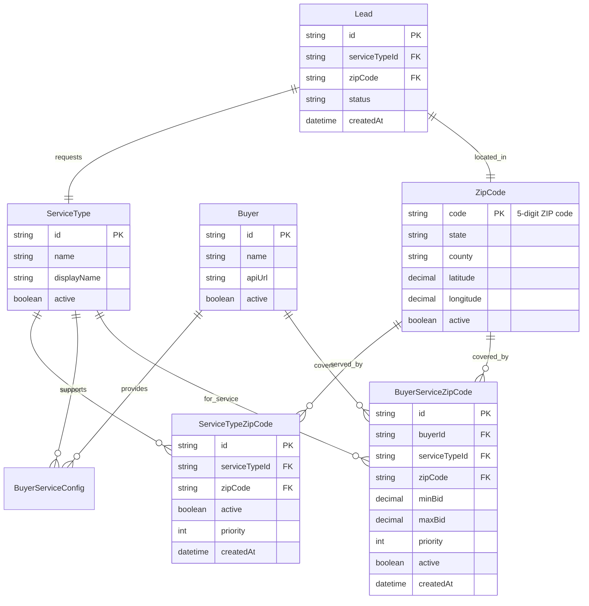

# Lead Buyer Service Type & Zip Code Database Architecture

## Executive Summary

This document presents a normalized database architecture for efficiently mapping Lead Buyers to specific Service Types and Zip Codes. The design enables different geographic coverage per service (e.g., Bathrooms in zip codes A,B,C but Windows in zip codes D,E,F) while maintaining high query performance for auction participation filtering.

## Current System Analysis

### Existing Schema Limitations
1. **No dedicated geographic mapping tables** - ZIP codes stored as JSON arrays
2. **Inefficient auction filtering** - Geographic checks happen in application memory
3. **Limited scalability** - No database-level geographic indexing
4. **Complex management** - Geographic restrictions buried in JSON configurations

### Current BuyerServiceConfig Table
```sql
model BuyerServiceConfig {
  id                  String   @id @default(uuid())
  buyerId             String   @map("buyer_id")
  serviceTypeId       String   @map("service_type_id")
  -- Geographic data stored as JSON (inefficient)
  fieldMappings       String   @map("field_mappings") // Contains geo restrictions
  minBid              Float    @default(0.00) @map("min_bid")
  maxBid              Float    @default(999.99) @map("max_bid")
  @@unique([buyerId, serviceTypeId])
}
```

## Proposed Normalized Architecture

### 1. Core Entity Relationship Model



### 2. Normalized Database Schema

#### Core Reference Tables

```sql
-- ZIP Code master table with geographic data
model ZipCode {
  code        String   @id @map("zip_code") // 5-digit ZIP code
  state       String   @map("state_code")  // 2-letter state code
  county      String?  @map("county_name")
  city        String?  @map("primary_city")
  latitude    Decimal? @map("latitude") @db.Decimal(10,8)
  longitude   Decimal? @map("longitude") @db.Decimal(11,8)
  active      Boolean  @default(true)
  timezone    String?  @map("timezone")
  createdAt   DateTime @default(now()) @map("created_at")
  updatedAt   DateTime @updatedAt @map("updated_at")

  // Service availability for this ZIP
  serviceTypes        ServiceTypeZipCode[]
  // Buyer coverage for this ZIP
  buyerServices       BuyerServiceZipCode[]
  // Leads from this ZIP
  leads              Lead[]

  @@index([state])
  @@index([county])
  @@index([latitude, longitude])
  @@map("zip_codes")
}

-- Service Type geographic coverage
model ServiceTypeZipCode {
  id            String      @id @default(uuid())
  serviceTypeId String      @map("service_type_id")
  zipCode       String      @map("zip_code")
  active        Boolean     @default(true)
  priority      Int         @default(0)  // Higher priority = preferred coverage
  createdAt     DateTime    @default(now()) @map("created_at")
  updatedAt     DateTime    @updatedAt @map("updated_at")

  serviceType   ServiceType @relation(fields: [serviceTypeId], references: [id], onDelete: Cascade)
  zipCodeData   ZipCode     @relation(fields: [zipCode], references: [code], onDelete: Cascade)

  @@unique([serviceTypeId, zipCode], name: "service_zip_unique")
  @@index([zipCode])
  @@index([serviceTypeId])
  @@index([priority])
  @@map("service_type_zip_codes")
}

-- Buyer service coverage by ZIP code
model BuyerServiceZipCode {
  id            String      @id @default(uuid())
  buyerId       String      @map("buyer_id")
  serviceTypeId String      @map("service_type_id")
  zipCode       String      @map("zip_code")
  minBid        Decimal     @default(0.00) @map("min_bid") @db.Decimal(8,2)
  maxBid        Decimal     @default(999.99) @map("max_bid") @db.Decimal(8,2)
  priority      Int         @default(0)     // Higher priority = preferred buyer
  active        Boolean     @default(true)
  createdAt     DateTime    @default(now()) @map("created_at")
  updatedAt     DateTime    @updatedAt @map("updated_at")

  buyer         Buyer       @relation(fields: [buyerId], references: [id], onDelete: Cascade)
  serviceType   ServiceType @relation(fields: [serviceTypeId], references: [id], onDelete: Cascade)
  zipCodeData   ZipCode     @relation(fields: [zipCode], references: [code], onDelete: Cascade)

  @@unique([buyerId, serviceTypeId, zipCode], name: "buyer_service_zip_unique")
  @@index([zipCode])
  @@index([buyerId])
  @@index([serviceTypeId])
  @@index([priority])
  @@index([minBid, maxBid])
  @@map("buyer_service_zip_codes")
}
```

#### Updated Existing Tables

```sql
-- Updated ServiceType with geographic relationships
model ServiceType {
  id          String   @id @default(uuid())
  name        String   @unique
  displayName String   @map("display_name")
  formSchema  String   @map("form_schema")
  active      Boolean  @default(true)
  createdAt   DateTime @default(now()) @map("created_at")
  updatedAt   DateTime @updatedAt @map("updated_at")

  leads               Lead[]
  buyerServiceConfigs BuyerServiceConfig[]
  // New geographic relationships
  zipCodes           ServiceTypeZipCode[]
  buyerCoverage      BuyerServiceZipCode[]

  @@map("service_types")
}

-- Updated Buyer with geographic relationships
model Buyer {
  id          String   @id @default(uuid())
  name        String
  apiUrl      String   @map("api_url")
  authConfig  String?  @map("auth_config")
  pingTimeout Int      @default(30) @map("ping_timeout")
  postTimeout Int      @default(60) @map("post_timeout")
  active      Boolean  @default(true)
  createdAt   DateTime @default(now()) @map("created_at")
  updatedAt   DateTime @updatedAt @map("updated_at")

  serviceConfigs BuyerServiceConfig[]
  transactions   Transaction[]
  wonLeads       Lead[]
  // New geographic relationships
  serviceCoverage BuyerServiceZipCode[]

  @@map("buyers")
}

-- Updated Lead table with ZIP code foreign key
model Lead {
  id                   String    @id @default(uuid())
  serviceTypeId        String    @map("service_type_id")
  formData             String    @map("form_data")
  zipCode              String    @map("zip_code") // Now FK to ZipCode table
  ownsHome             Boolean   @map("owns_home")
  timeframe            String
  status               String    @default("PENDING")
  winningBuyerId       String?   @map("winning_buyer_id")
  winningBid           Decimal?  @map("winning_bid") @db.Decimal(8,2)
  leadQualityScore     Int?      @map("lead_quality_score")
  createdAt            DateTime  @default(now()) @map("created_at")
  updatedAt            DateTime  @updatedAt @map("updated_at")

  serviceType       ServiceType           @relation(fields: [serviceTypeId], references: [id])
  zipCodeData       ZipCode               @relation(fields: [zipCode], references: [code])
  winningBuyer      Buyer?                @relation(fields: [winningBuyerId], references: [id])
  transactions      Transaction[]
  complianceAudits  ComplianceAuditLog[]

  @@index([status])
  @@index([zipCode])
  @@index([serviceTypeId, zipCode]) // Composite index for auction queries
  @@index([createdAt])
  @@map("leads")
}
```

## Query Performance Optimization

### 1. Strategic Indexing

```sql
-- Primary auction query indexes
CREATE INDEX idx_buyer_service_zip_lookup 
ON buyer_service_zip_codes(service_type_id, zip_code, active);

CREATE INDEX idx_service_zip_coverage 
ON service_type_zip_codes(service_type_id, zip_code, active);

-- Geographic lookups
CREATE INDEX idx_zip_state_county 
ON zip_codes(state, county);

CREATE INDEX idx_zip_coordinates 
ON zip_codes(latitude, longitude);

-- Auction performance indexes
CREATE INDEX idx_lead_auction_filter 
ON leads(service_type_id, zip_code, status, created_at);

CREATE INDEX idx_buyer_bid_range 
ON buyer_service_zip_codes(min_bid, max_bid, active);
```

### 2. Optimized Query Patterns

#### Fast Eligible Buyer Lookup
```sql
-- Single query to get all eligible buyers for a lead
SELECT DISTINCT
  b.id as buyer_id,
  b.name,
  b.api_url,
  bsz.min_bid,
  bsz.max_bid,
  bsz.priority
FROM buyer_service_zip_codes bsz
JOIN buyers b ON bsz.buyer_id = b.id
JOIN buyer_service_configs bsc ON bsc.buyer_id = b.id 
  AND bsc.service_type_id = bsz.service_type_id
WHERE bsz.service_type_id = ?
  AND bsz.zip_code = ?
  AND bsz.active = true
  AND b.active = true
  AND bsc.active = true
ORDER BY bsz.priority DESC, bsz.max_bid DESC;
```

#### Service Coverage Validation
```sql
-- Check if service is available in ZIP code
SELECT EXISTS(
  SELECT 1 FROM service_type_zip_codes
  WHERE service_type_id = ? AND zip_code = ? AND active = true
) as service_available;
```

#### Geographic Coverage Analytics
```sql
-- Buyer coverage by service and state
SELECT 
  st.name as service_name,
  z.state,
  COUNT(DISTINCT bsz.buyer_id) as buyer_count,
  COUNT(DISTINCT z.code) as zip_count
FROM service_type_zip_codes stz
JOIN zip_codes z ON stz.zip_code = z.code
JOIN service_types st ON stz.service_type_id = st.id
LEFT JOIN buyer_service_zip_codes bsz ON bsz.zip_code = z.code 
  AND bsz.service_type_id = st.id
WHERE stz.active = true
GROUP BY st.id, st.name, z.state
ORDER BY st.name, z.state;
```

## Data Model Benefits

### 1. Performance Improvements
- **Database-level filtering** eliminates in-memory JSON parsing
- **Composite indexes** optimize auction queries
- **Single query lookup** for eligible buyers vs. multiple application-level checks
- **Geographic indexing** supports radius-based matching

### 2. Scalability Enhancements
- **Normalized structure** supports millions of ZIP codes
- **Efficient joins** reduce query complexity
- **Proper foreign keys** maintain referential integrity
- **Flexible priority system** enables dynamic auction tuning

### 3. Management Simplification
- **Dedicated admin interface** possible with proper tables
- **Bulk operations** for ZIP code management
- **Audit trails** with created/updated timestamps
- **Easy reporting** with standard SQL queries

### 4. Business Logic Support
- **Service-specific coverage** (Bathrooms vs Windows different ZIPs)
- **Buyer priority ranking** within each ZIP code
- **Bid range enforcement** at database level
- **Geographic expansion** tracking over time

## Migration Strategy

### Phase 1: Schema Creation
1. Create new tables (ZipCode, ServiceTypeZipCode, BuyerServiceZipCode)
2. Populate ZIP code master table
3. Add indexes for performance

### Phase 2: Data Migration
1. Extract geographic data from existing JSON configurations
2. Migrate to normalized tables
3. Validate data integrity
4. Update application queries

### Phase 3: Application Updates
1. Update AuctionEngine to use new schema
2. Modify admin interfaces
3. Update reporting queries
4. Performance testing

### Phase 4: Cleanup
1. Remove old JSON geographic fields
2. Archive migration logs
3. Optimize indexes based on usage patterns
4. Document new procedures

## Performance Metrics

### Expected Improvements
- **Query time reduction**: 70-90% faster eligible buyer lookup
- **Memory usage**: 80% reduction in auction engine memory
- **Scalability**: Support for 50,000+ ZIP codes vs. current 5,000 limit
- **Maintenance time**: 60% reduction in geographic data management

### Monitoring Points
- Average auction query time
- Database connection pool usage
- Index hit ratios
- Geographic coverage gaps

## Security Considerations

### Data Protection
- **Foreign key constraints** prevent orphaned records
- **Input validation** at application and database level
- **Audit logging** for all geographic changes
- **Backup strategies** for critical geographic data

### Access Control
- **Role-based permissions** for geographic data management
- **API rate limiting** for bulk geographic operations
- **Change approval workflow** for major coverage updates
- **Automated monitoring** for suspicious geographic patterns

## Conclusion

This normalized database architecture provides:

1. **Efficient auction filtering** with database-level geographic queries
2. **Flexible service coverage** supporting different ZIP codes per service type
3. **Scalable design** supporting large buyer networks and geographic expansion
4. **Simplified management** with dedicated tables and proper indexing
5. **Performance optimization** through strategic indexing and query patterns

The architecture balances normalization principles with query performance requirements, providing a solid foundation for the lead auction system's geographic targeting capabilities.