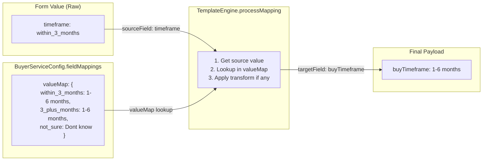
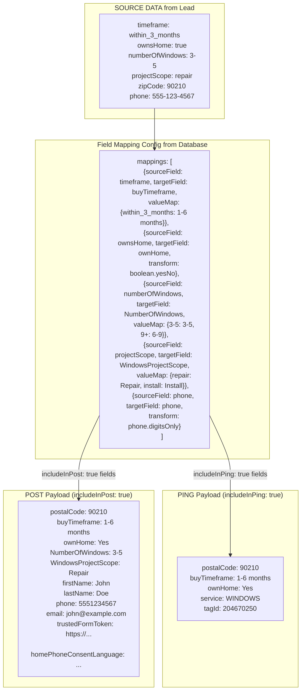
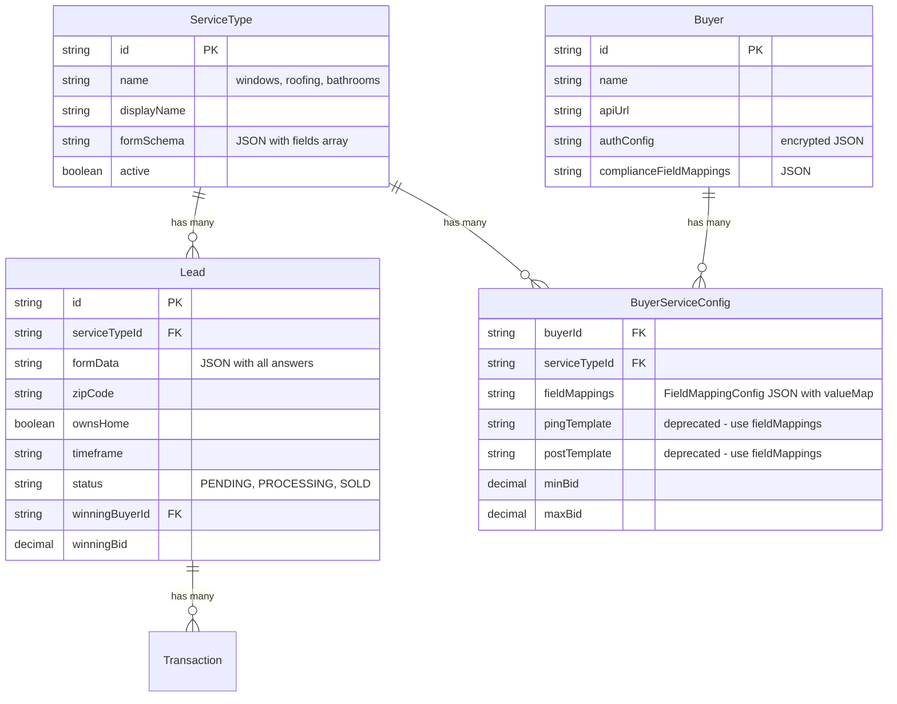
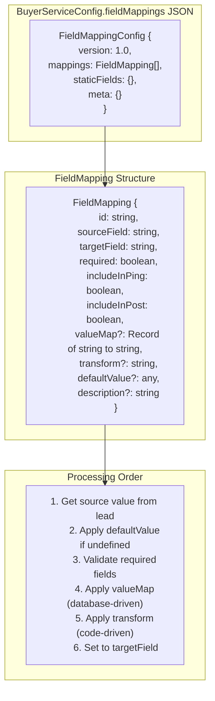

# Lead System Flow

## Complete Data Flow Diagram

```mermaid
flowchart TD
    subgraph "1. USER VISITS SERVICE PAGE"
        A[User visits /services/windows] --> B[Dynamic Page Loads]
    end

    subgraph "2. FETCH QUESTION FLOW FROM DATABASE"
        B --> C[Fetch /api/services/windows/flow]
        C --> D[(Database: ServiceType)]
        D --> E[Get formSchema JSON]
        E --> F[flow-builder.ts]
        F --> G[Build QuestionFlow]
    end

    subgraph "3. FORM RENDERING"
        G --> H[Return QuestionFlow to Page]
        H --> I[DynamicForm Component]
        I --> J[Render Service Questions<br/>projectScope, numberOfWindows]
        J --> K[Render Standard Questions<br/>address, timeline, isHomeowner, name, contact]
    end

    subgraph "4. USER FILLS FORM"
        K --> L[User Answers Questions<br/>projectScope: repair<br/>numberOfWindows: 3-5<br/>timeline: within_3_months<br/>isHomeowner: yes]
        L --> M[Compliance Tokens Captured<br/>TrustedForm, Jornaya]
    end

    subgraph "5. FORM SUBMISSION"
        M --> N[Submit to /api/leads]
        N --> O[page.tsx transforms:<br/>ownsHome = isHomeowner === yes<br/>timeframe = timeline]
        O --> P[Validate with Dynamic Zod Schema]
        P --> Q[Create Lead Record]
    end

    subgraph "6. LEAD STORAGE"
        Q --> R[(Database: Lead)]
        R --> S[Stored:<br/>ownsHome: true<br/>timeframe: within_3_months<br/>formData: JSON with raw values]
    end

    subgraph "7. AUCTION ENGINE"
        S --> T[Auction Engine Triggered]
        T --> U[Find Eligible Buyers<br/>by ZIP + Service + Compliance]
        U --> V[database-buyer-loader.ts]
        V --> W[Load BuyerServiceConfig.fieldMappings]
    end

    subgraph "8. TEMPLATE ENGINE - PING"
        W --> X[TemplateEngine.transform]
        X --> Y[prepareSourceData flattens formData]
        Y --> Z[processMapping applies:<br/>1. valueMap lookup<br/>2. transform functions]
        Z --> AA[PING Payload:<br/>buyTimeframe: 1-6 months<br/>ownHome: Yes<br/>postalCode: 90210]
        AA --> AB[Send PING to Buyer API]
        AB --> AC[Buyer Returns Bid Amount]
    end

    subgraph "9. SELECT WINNER"
        AC --> AD[Compare All Bids]
        AD --> AE[Select Highest Bidder]
    end

    subgraph "10. TEMPLATE ENGINE - POST"
        AE --> AF[TemplateEngine.transform with POST template]
        AF --> AG[POST Payload includes:<br/>NumberOfWindows: 3-5<br/>WindowsProjectScope: Repair<br/>+ all contact info]
        AG --> AH[Send POST with Full Lead Data]
        AH --> AI[Buyer Accepts Lead]
    end

    subgraph "11. COMPLETE"
        AI --> AJ[Update Lead Status: SOLD]
        AJ --> AK[Record Transaction]
    end
```

## Value Transformation Flow (Database-Driven)

## Windows Lead Transformation Example

## Database Schema Relationship

## FieldMappingConfig Structure

## Key Files in Lead Flow

| Step | File | Purpose |
|------|------|---------|
| 1 | `src/app/services/[slug]/page.tsx` | Service page, transforms isHomeowner→ownsHome |
| 2 | `src/components/forms/dynamic/DynamicForm.tsx` | Form component with compliance |
| 3 | `src/app/api/leads/route.ts` | Creates Lead in database |
| 4 | `src/workers/lead-processor.ts` | Processes lead queue |
| 5 | `src/lib/auction/engine.ts` | Runs auction, calls TemplateEngine |
| 6 | `src/lib/field-mapping/database-buyer-loader.ts` | Loads fieldMappings, converts to TemplateMapping |
| 7 | `src/lib/templates/engine.ts` | Applies valueMap + transforms |
| 8 | `prisma/migrations/2026-01-08-modernize-field-mappings.sql` | Modernize field mapping config |

## Standard Questions (Auto-Added by flow-builder)

These are automatically added to every service flow:

| Step | Field Name | Type | Purpose |
|------|------------|------|---------|
| 1 | `address` | address | ZIP code for buyer matching |
| 2 | `timeline` | select | Project urgency (within_3_months, 3_plus_months, not_sure) |
| 3 | `isHomeowner` | select | Ownership verification (yes/no → boolean) |
| 4 | `authorizationConfirm` | select | (if not homeowner) |
| 5 | `nameInfo` | name_fields | firstName, lastName |
| 6 | `contactInfo` | contact_fields | email, phone |

## Service-Specific Questions (From Database formSchema)

| Service | Fields |
|---------|--------|
| Windows | `projectScope` (repair/install), `numberOfWindows` (1, 2, 3-5, 6-9, 9+) |
| Bathrooms | `projectScope` (full_renovation, partial_remodel, new_bathroom, repair) |
| Roofing | `projectScope` (repair, replacement, installation), `roofType`, `roofSize` |
| HVAC | `projectScope` (install_ac, repair_ac, etc.) |

## Modernize API Value Mappings

### buyTimeframe
| Form Value | Modernize Value |
|------------|-----------------|
| within_3_months | 1-6 months |
| 3_plus_months | 1-6 months |
| not_sure | Don't know |
| immediately | Immediately |

### ownHome
| Lead Value | Modernize Value |
|------------|-----------------|
| true | Yes |
| false | No |

### NumberOfWindows
| Form Value | Modernize Value |
|------------|-----------------|
| 1 | 1 |
| 2 | 2 |
| 3-5 | 3-5 |
| 6-9 | 6-9 |
| 9+ | 6-9 |

### WindowsProjectScope
| Form Value | Modernize Value |
|------------|-----------------|
| repair | Repair |
| install | Install |

### BATH_REMODEL OptIn1 (walls removal)
| Form Value | Modernize Value |
|------------|-----------------|
| full_renovation | Yes |
| partial_remodel | No |
| new_bathroom | Yes |
| repair | No |
