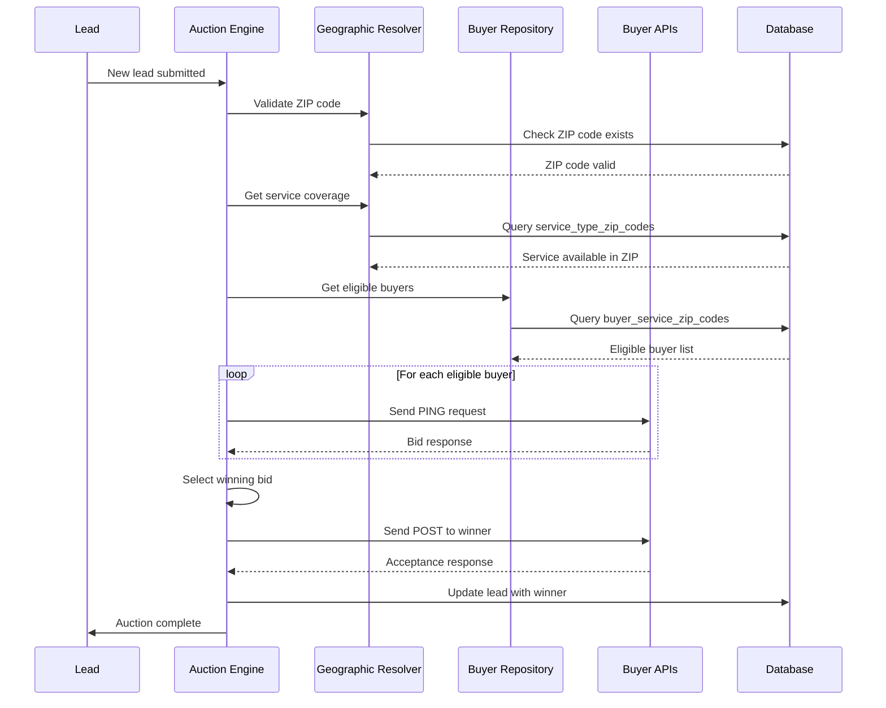
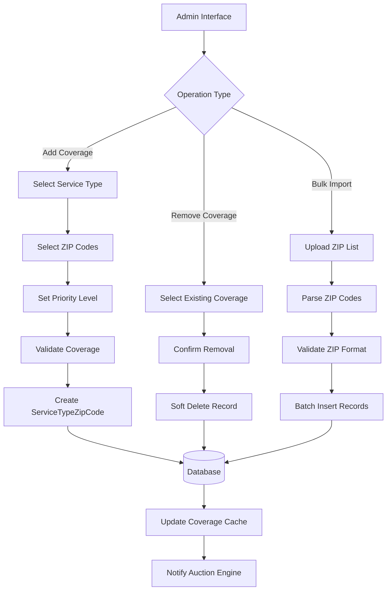
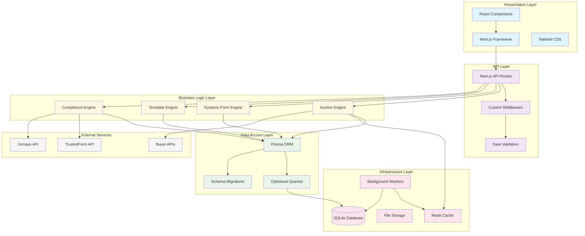
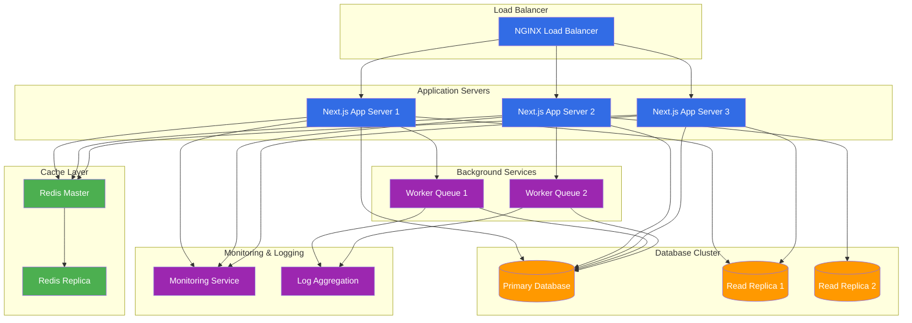

# System Architecture Diagrams
## Lead Buyer Geographic Mapping System

## C4 Model Architecture Diagrams

### Level 1: System Context Diagram

```mermaid
graph TB
    %% External Actors
    Consumer[Lead Consumer<br/>Home Owner]
    Admin[System Administrator]
    Buyer[Lead Buyer<br/>Contractor]
    
    %% Main System
    Platform[My Contractor Now<br/>Lead Generation Platform]
    
    %% External Systems
    TrustedForm[TrustedForm<br/>Compliance Service]
    Jornaya[Jornaya<br/>Lead Intelligence]
    Payment[Payment Gateway]
    
    %% Relationships
    Consumer --> Platform : "Submits service requests"
    Admin --> Platform : "Manages buyers & coverage"
    Platform --> Buyer : "Sends leads via API"
    Buyer --> Platform : "Responds with bids"
    
    Platform --> TrustedForm : "Generates compliance certificates"
    Platform --> Jornaya : "Captures lead intelligence"
    Platform --> Payment : "Processes payments"
    
    classDef system fill:#326ce5,color:#fff
    classDef external fill:#ff9900,color:#fff
    classDef person fill:#08427b,color:#fff
    
    class Platform system
    class TrustedForm,Jornaya,Payment external
    class Consumer,Admin,Buyer person
```

### Level 2: Container Diagram

```mermaid
graph TB
    %% External Actors
    Consumer[Lead Consumer]
    Admin[Admin User]
    Buyer[Lead Buyer]
    
    %% Web Application
    WebApp[Web Application<br/>Next.js Frontend<br/><br/>Lead forms, Admin dashboard]
    
    %% API Application  
    API[API Application<br/>Next.js API Routes<br/><br/>Lead processing, Auction engine]
    
    %% Database
    DB[(Database<br/>SQLite/Prisma<br/><br/>Leads, Buyers, Geographic mapping)]
    
    %% Background Services
    Queue[Background Workers<br/>Node.js<br/><br/>Lead processing, Auction execution]
    
    %% External Systems
    TrustedForm[TrustedForm API]
    Jornaya[Jornaya API]
    BuyerAPIs[Buyer APIs<br/>Various contractors]
    
    %% Relationships
    Consumer --> WebApp : "Submits forms"
    Admin --> WebApp : "Manages system"
    Buyer --> BuyerAPIs : "Receives leads"
    
    WebApp --> API : "HTTPS/REST"
    API --> DB : "SQL queries"
    API --> Queue : "Job scheduling"
    Queue --> DB : "Data updates"
    
    API --> TrustedForm : "HTTPS/REST"
    API --> Jornaya : "HTTPS/REST"
    Queue --> BuyerAPIs : "HTTPS/REST"
    
    classDef container fill:#326ce5,color:#fff
    classDef database fill:#ff9900,color:#fff
    classDef external fill:#999999,color:#fff
    classDef person fill:#08427b,color:#fff
    
    class WebApp,API,Queue container
    class DB database
    class TrustedForm,Jornaya,BuyerAPIs external
    class Consumer,Admin,Buyer person
```

### Level 3: Component Diagram - Auction Engine

```mermaid
graph TB
    subgraph "Auction Engine System"
        %% Core Components
        AuctionController[Auction Controller<br/>Orchestrates auction flow]
        EligibilityEngine[Eligibility Engine<br/>Filters buyers by geography]
        BiddingEngine[Bidding Engine<br/>Manages PING/POST cycle]
        WinnerSelector[Winner Selection<br/>Applies auction logic]
        
        %% Geographic Components  
        GeoResolver[Geographic Resolver<br/>ZIP code validation]
        CoverageValidator[Coverage Validator<br/>Service area checking]
        
        %% Data Access Layer
        BuyerRepository[Buyer Repository<br/>Buyer data access]
        GeographicRepository[Geographic Repository<br/>ZIP/Service mapping]
        
        %% External Interfaces
        TemplateEngine[Template Engine<br/>PING/POST formatting]
        APIConnector[API Connector<br/>Buyer communication]
    end
    
    %% Database Tables
    subgraph "Database Schema"
        BuyerTable[(buyers)]
        ServiceTypeTable[(service_types)]
        ZipCodeTable[(zip_codes)]
        BuyerServiceZipTable[(buyer_service_zip_codes)]
        ServiceTypeZipTable[(service_type_zip_codes)]
        LeadTable[(leads)]
    end
    
    %% Flow
    AuctionController --> EligibilityEngine
    EligibilityEngine --> GeoResolver
    EligibilityEngine --> CoverageValidator
    EligibilityEngine --> BuyerRepository
    EligibilityEngine --> GeographicRepository
    
    AuctionController --> BiddingEngine
    BiddingEngine --> TemplateEngine
    BiddingEngine --> APIConnector
    
    AuctionController --> WinnerSelector
    
    %% Data Access
    BuyerRepository --> BuyerTable
    BuyerRepository --> ServiceTypeTable
    GeographicRepository --> ZipCodeTable
    GeographicRepository --> BuyerServiceZipTable
    GeographicRepository --> ServiceTypeZipTable
    GeographicRepository --> LeadTable
    
    classDef component fill:#326ce5,color:#fff
    classDef database fill:#ff9900,color:#fff
    
    class AuctionController,EligibilityEngine,BiddingEngine,WinnerSelector component
    class GeoResolver,CoverageValidator,BuyerRepository,GeographicRepository component  
    class TemplateEngine,APIConnector component
    class BuyerTable,ServiceTypeTable,ZipCodeTable database
    class BuyerServiceZipTable,ServiceTypeZipTable,LeadTable database
```

### Level 4: Code Diagram - Geographic Mapping

```mermaid
classDiagram
    class ZipCode {
        +String code PK
        +String stateCode
        +String county
        +String city
        +Decimal latitude
        +Decimal longitude
        +Boolean active
        +DateTime createdAt
        +DateTime updatedAt
    }
    
    class ServiceType {
        +String id PK
        +String name
        +String displayName
        +String formSchema
        +Boolean active
        +DateTime createdAt
        +DateTime updatedAt
    }
    
    class Buyer {
        +String id PK
        +String name
        +String apiUrl
        +String authConfig
        +Integer pingTimeout
        +Integer postTimeout
        +Boolean active
        +DateTime createdAt
        +DateTime updatedAt
    }
    
    class ServiceTypeZipCode {
        +String id PK
        +String serviceTypeId FK
        +String zipCode FK
        +Boolean active
        +Integer priority
        +DateTime createdAt
        +DateTime updatedAt
    }
    
    class BuyerServiceZipCode {
        +String id PK
        +String buyerId FK
        +String serviceTypeId FK
        +String zipCode FK
        +Decimal minBid
        +Decimal maxBid
        +Integer priority
        +Boolean active
        +DateTime createdAt
        +DateTime updatedAt
    }
    
    class Lead {
        +String id PK
        +String serviceTypeId FK
        +String zipCode FK
        +String formData
        +Boolean ownsHome
        +String timeframe
        +String status
        +String winningBuyerId FK
        +Decimal winningBid
        +DateTime createdAt
        +DateTime updatedAt
    }
    
    %% Relationships
    ServiceType ||--o{ ServiceTypeZipCode : "serves ZIP codes"
    ZipCode ||--o{ ServiceTypeZipCode : "served by services"
    
    Buyer ||--o{ BuyerServiceZipCode : "covers areas"
    ServiceType ||--o{ BuyerServiceZipCode : "for service"
    ZipCode ||--o{ BuyerServiceZipCode : "covered by buyers"
    
    ServiceType ||--o{ Lead : "requested service"
    ZipCode ||--o{ Lead : "lead location"
    Buyer ||--o{ Lead : "winning buyer"
```

## Data Flow Diagrams

### Auction Process Flow



### Geographic Coverage Management



## Technology Stack Architecture

### Infrastructure Layers



## Deployment Architecture

### Production Environment



## Quality Attributes & Non-Functional Requirements

### Performance Architecture

- **Response Time**: < 200ms for auction eligibility queries
- **Throughput**: Support 1,000+ concurrent auctions
- **Scalability**: Horizontal scaling of app servers
- **Caching**: Multi-level caching strategy (Redis, application, database)

### Security Architecture

- **Authentication**: JWT-based session management
- **Authorization**: Role-based access control (RBAC)
- **Data Encryption**: Encryption at rest and in transit
- **API Security**: Rate limiting, input validation, CORS policies

### Reliability Architecture

- **High Availability**: 99.9% uptime target
- **Fault Tolerance**: Graceful degradation for external API failures
- **Backup Strategy**: Daily automated backups with point-in-time recovery
- **Monitoring**: Comprehensive application and infrastructure monitoring

### Maintainability Architecture

- **Code Organization**: Modular component architecture
- **Documentation**: Comprehensive API and system documentation
- **Testing**: Unit, integration, and end-to-end test coverage
- **Deployment**: Automated CI/CD pipeline with rollback capabilities

This architecture provides a scalable, maintainable foundation for the lead buyer geographic mapping system while supporting efficient auction processing and flexible business requirements.